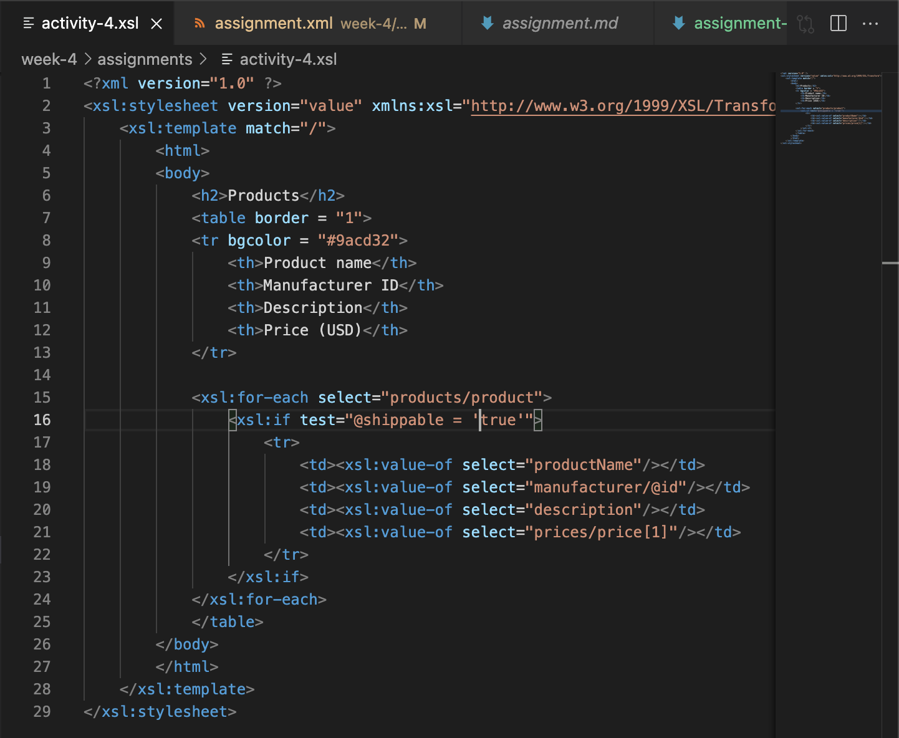
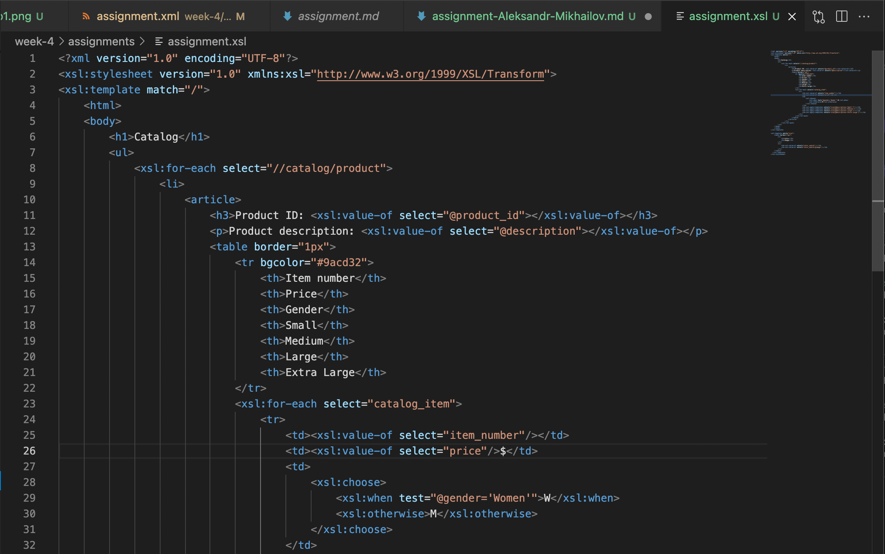
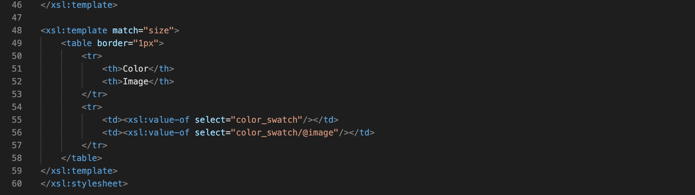
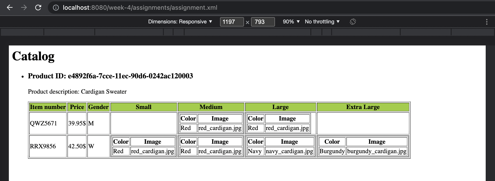

# Week 4 assignment thought process explanation

## 1. General thoughts

Once again, my thought process was pretty straightforward since the task is fairly trivial. It basically comes down to designing a markdown for a page like we did in the first semester, but this time there's a dynamic data twist to it and a bit of new stuff in the form of XSL features. Templates are extremely helpful at avoiding redundant code!

What surprises me is how XSL heavily resembles the workflow of modern frontend frameworks like React and Vue and it sort of makes me wonder why do we need those in the first place. Everything new is long forgotten old, right?

## 2. Step-by-step completion

First thing I did is I copied activity 4 XSL, which I copied earlier from your activity 3 XSL, and used it as a basis for the assignment. Generally it already has all the functionality I need implemented besides reusing templates, but I'll get to that in a bit.

I proceeded to add a Header 3, a Paragraph and all the stuff listed in assignment.md.

I anticipated that there'd be a ton of redundant code when it comes down to listing the sizes of items, so I decided to use templates which I'm absolutely in love with now.

And here's my final result!

